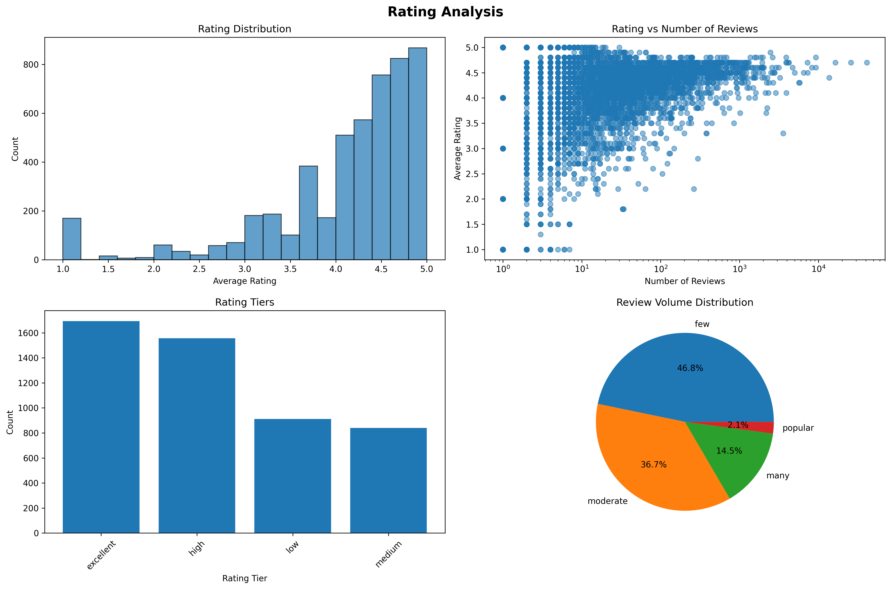
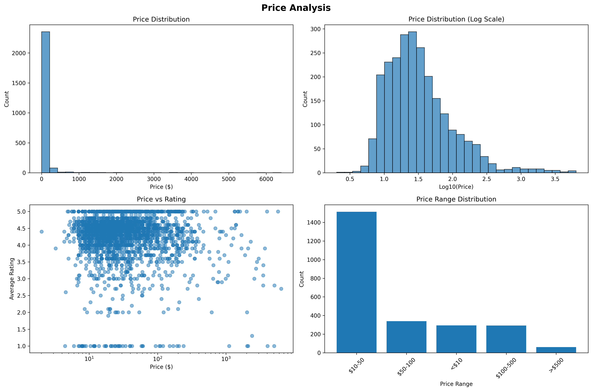
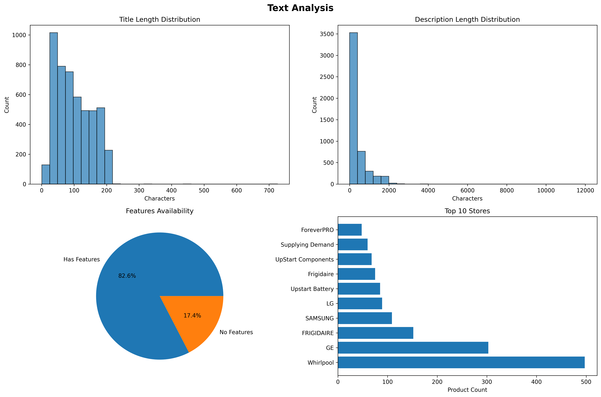
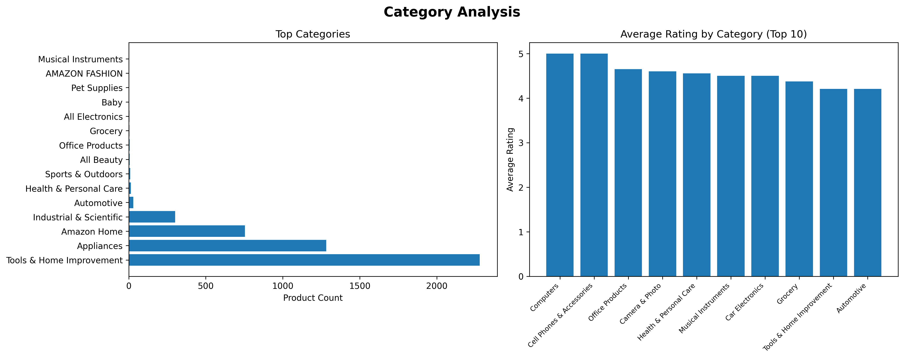
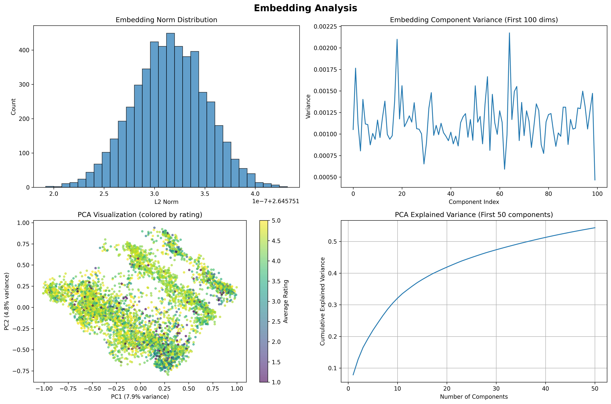

# Dataset Analysis Report: appliances_with_embeddings

Generated on: 2025-08-09 23:50:23

## Dataset Overview

- **Total Records**: 5,000
- **Total Columns**: 16
- **Memory Usage**: 140.3 MB

### Column Information

| Column | Type | Non-Null Count | Unique Values |
|--------|------|----------------|---------------|
| parent_asin | object | 5,000 | 5,000 |
| title | object | 5,000 | 4,977 |
| description | object | 5,000 | 3,168 |
| features | object | 5,000 | 3,882 |
| combined_text | object | 5,000 | 4,985 |
| average_rating | float64 | 5,000 | 38 |
| rating_number | int64 | 5,000 | 557 |
| price | float64 | 2,498 | 1,452 |
| main_category | object | 4,704 | 20 |
| categories | object | 5,000 | N/A |
| store | object | 4,958 | 1,818 |
| details | object | 5,000 | N/A |
| has_price | bool | 5,000 | 2 |
| rating_tier | category | 5,000 | 4 |
| review_volume | category | 5,000 | 4 |
| embedding | embedding (array) | 5,000 | N/A |

## Rating Analysis

- **Average Rating**: 4.10
- **Median Rating**: 4.30
- **Rating Standard Deviation**: 0.89
- **Total Reviews**: 621,508

## Price Analysis

- **Average Price**: $92.57
- **Median Price**: $26.88
- **Price Range**: $2.02 - $6399.00
- **Items with Price**: 2,498 (50.0%)

## Text Analysis

- **Average Title Length**: 100 characters
- **Average Description Length**: 347 characters
- **Items with Features**: 82.6%

## Category Analysis

- **Unique Categories**: 20
- **Top Category**: Tools & Home Improvement (2278 items)

## Embedding Analysis

- **Embedding Dimensions**: 2688
- **Average L2 Norm**: 2.646 ± 0.000
- **PCA Variance Explained (2D)**: 12.7%
- **PCA Variance Explained (50D)**: 54.3%

## Interactive Visualization

For interactive exploration of embeddings and data relationships, the dataset is also available through Apple's Embedding Atlas visualization tool.

The interactive visualization provides:
- 2D/3D embedding projections using UMAP
- Interactive filtering and search
- Nearest neighbor exploration
- Real-time clustering analysis

