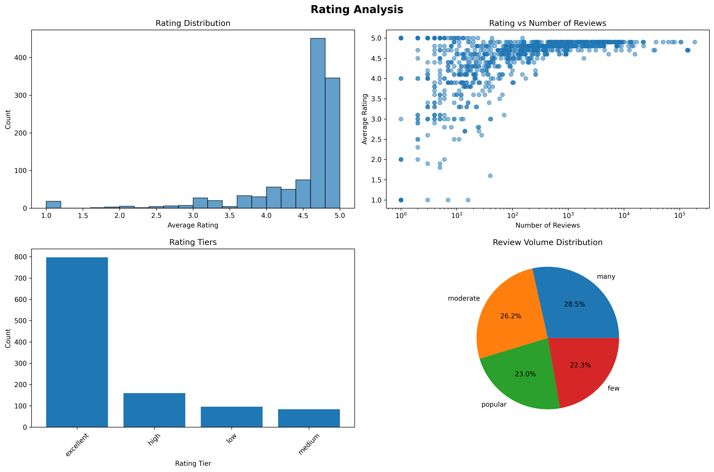
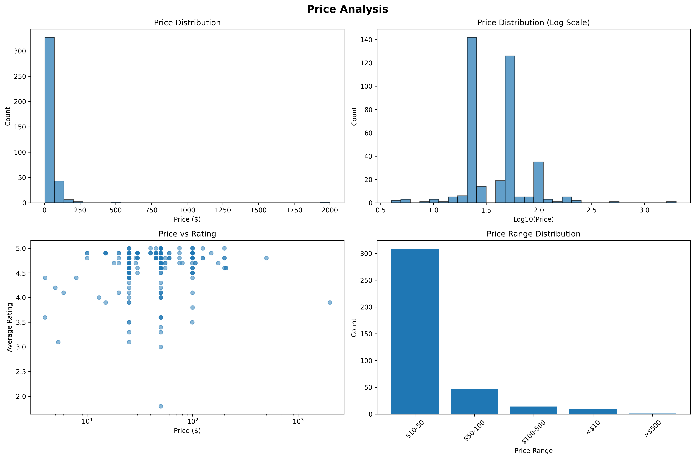
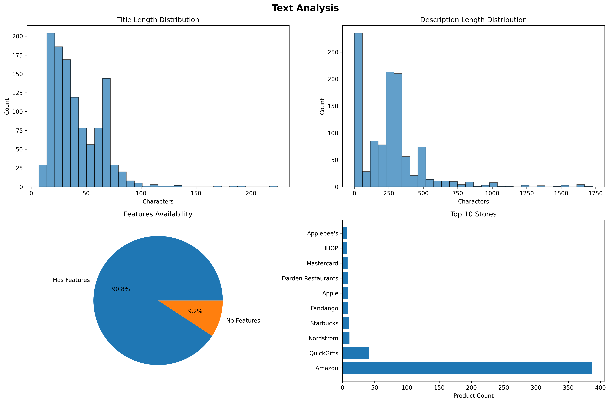
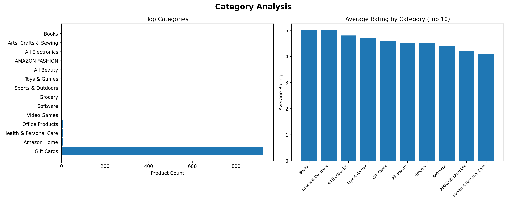
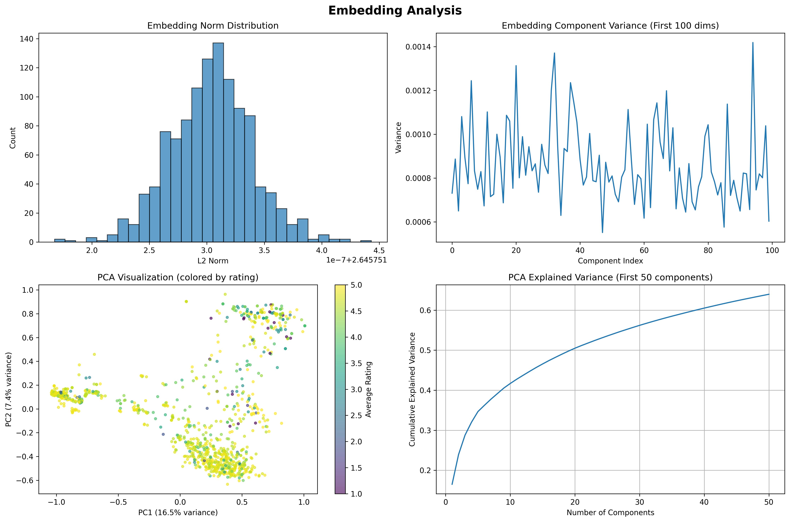

# Dataset Analysis Report: gift_cards_with_embeddings

Generated on: 2025-08-09 23:49:45

## Dataset Overview

- **Total Records**: 1,137
- **Total Columns**: 16
- **Memory Usage**: 3.9 MB

### Column Information

| Column | Type | Non-Null Count | Unique Values |
|--------|------|----------------|---------------|
| parent_asin | object | 1,137 | 1,137 |
| title | object | 1,137 | 852 |
| description | object | 1,137 | 426 |
| features | object | 1,137 | 550 |
| combined_text | object | 1,137 | 941 |
| average_rating | float64 | 1,137 | 31 |
| rating_number | int64 | 1,137 | 532 |
| price | float64 | 380 | 32 |
| main_category | object | 967 | 14 |
| categories | object | 1,137 | N/A |
| store | object | 1,120 | 437 |
| details | object | 1,137 | N/A |
| has_price | bool | 1,137 | 2 |
| rating_tier | category | 1,137 | 4 |
| review_volume | category | 1,137 | 4 |
| embedding | embedding (array) | 1,137 | N/A |

## Rating Analysis

- **Average Rating**: 4.49
- **Median Rating**: 4.80
- **Rating Standard Deviation**: 0.71
- **Total Reviews**: 2,561,190

## Price Analysis

- **Average Price**: $52.62
- **Median Price**: $45.00
- **Price Range**: $3.99 - $2000.00
- **Items with Price**: 380 (33.4%)

## Text Analysis

- **Average Title Length**: 41 characters
- **Average Description Length**: 257 characters
- **Items with Features**: 90.8%

## Category Analysis

- **Unique Categories**: 14
- **Top Category**: Gift Cards (926 items)

## Embedding Analysis

- **Embedding Dimensions**: 2688
- **Average L2 Norm**: 2.646 ± 0.000
- **PCA Variance Explained (2D)**: 23.9%
- **PCA Variance Explained (50D)**: 64.0%

## Interactive Visualization

For interactive exploration of embeddings and data relationships, the dataset is also available through Apple's Embedding Atlas visualization tool.

The interactive visualization provides:
- 2D/3D embedding projections using UMAP
- Interactive filtering and search
- Nearest neighbor exploration
- Real-time clustering analysis

