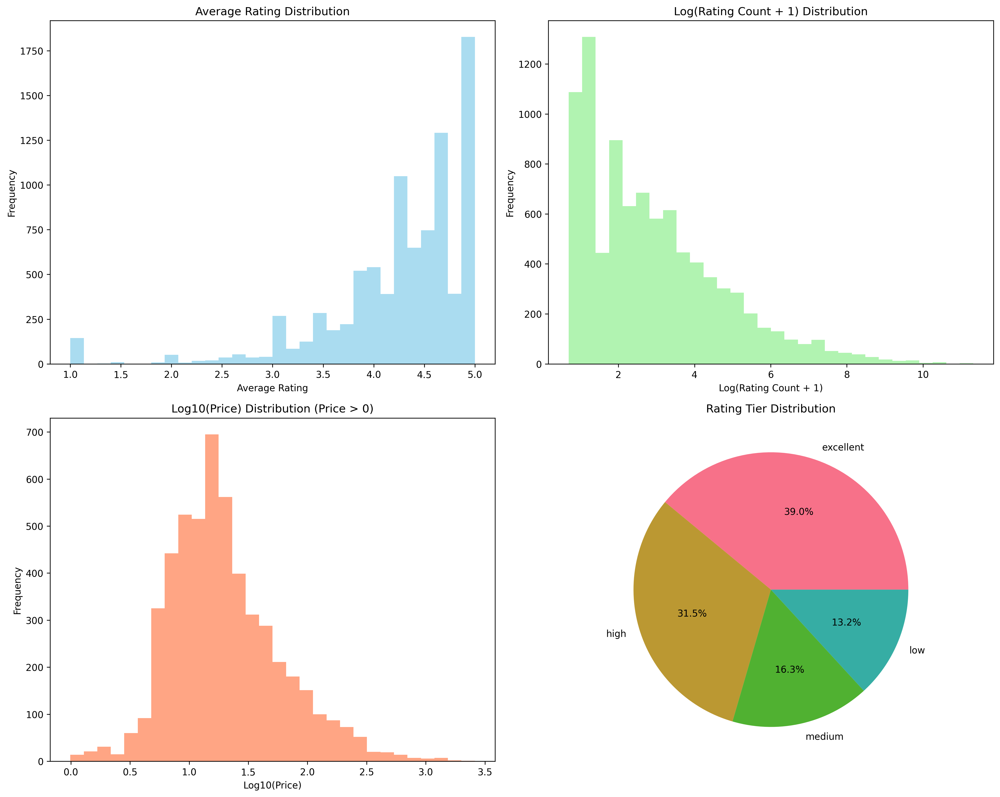
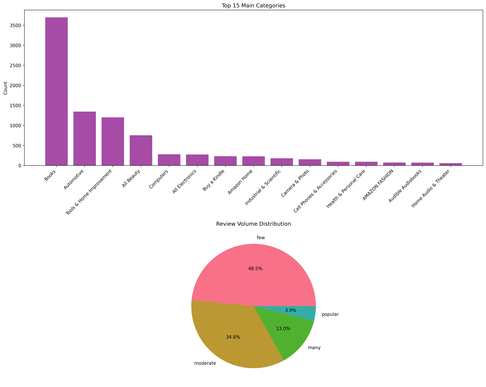
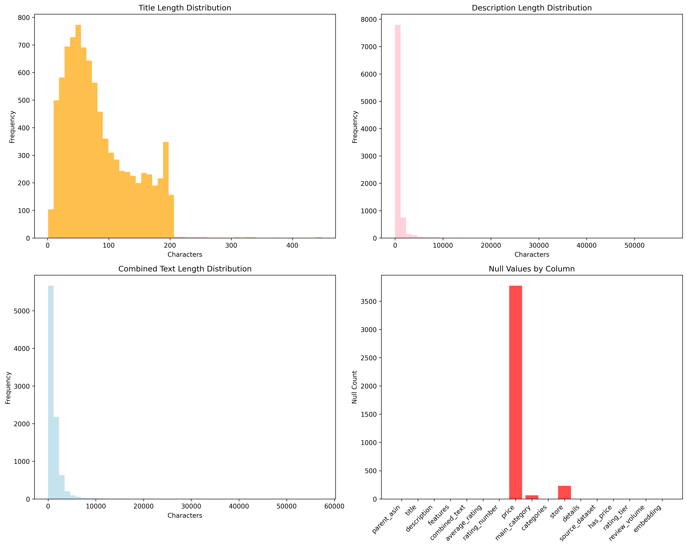
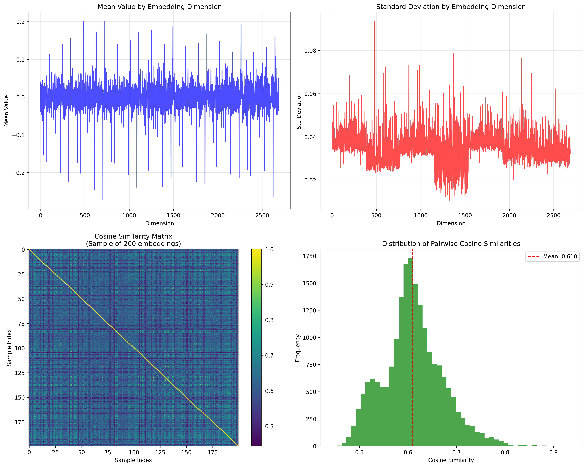
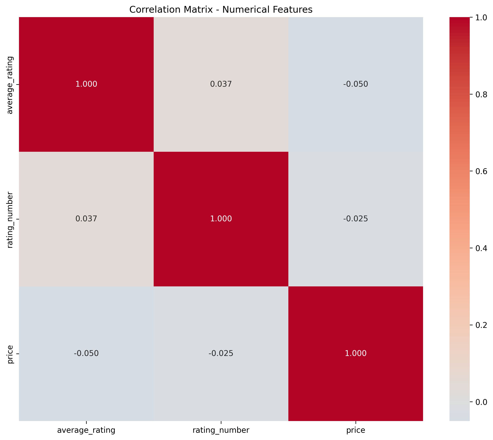

# Benchmark Dataset Analysis Report - 10K

**Generated:** 2025-08-10 23:46:11

## Dataset Overview

| Metric | Value |
|--------|--------|
| Dataset Size | 10k |
| Total Records | 9,000 |
| Total Columns | 17 |
| File Size | 207.2 MB |

## Schema Information

The dataset contains the following columns:
- **parent_asin** (`object`) - 0.0% null
- **title** (`object`) - 0.0% null
- **description** (`object`) - 0.0% null
- **features** (`object`) - 0.0% null
- **combined_text** (`object`) - 0.0% null
- **average_rating** (`float64`) - 0.0% null
- **rating_number** (`int64`) - 0.0% null
- **price** (`float64`) - 41.9% null
- **main_category** (`object`) - 0.7% null
- **categories** (`object`) - 0.0% null
- **store** (`object`) - 2.6% null
- **details** (`object`) - 0.0% null
- **source_dataset** (`object`) - 0.0% null
- **has_price** (`bool`) - 0.0% null
- **rating_tier** (`object`) - 0.0% null
- **review_volume** (`object`) - 0.0% null
- **embedding** (`object`) - 0.0% null

## Comprehensive Analysis

### Rating Analysis

- **Average Rating Range:** 1.00 - 5.00
- **Median Rating:** 4.40
- **Products with Ratings:** 9,000 (100.0%)

### Category Analysis

**Top 5 Main Categories:**
- Books: 3,695 (41.1%)
- Automotive: 1,343 (14.9%)
- Tools & Home Improvement: 1,200 (13.3%)
- All Beauty: 754 (8.4%)
- Computers: 279 (3.1%)

### Text Analysis

**Text Field Statistics:**
- **title**: Avg length 84 chars, Range 1-448
- **description**: Avg length 630 chars, Range 0-57135
- **features**: Avg length 596 chars, Range 0-6420
- **combined_text**: Avg length 1311 chars, Range 1-57382

### Embedding Analysis

- **Embedding Dimension:** 2688
- **Sample Size Analyzed:** 9000
- **Average Vector Norm:** 2.646 ± 0.000

The embedding visualizations show:
- **PCA Projection**: Linear dimensionality reduction preserving global structure
- **t-SNE Projection**: Non-linear reduction emphasizing local neighborhoods  
- **UMAP Projection**: Balanced approach preserving both local and global structure
- **Statistical Analysis**: Vector norms, dimension-wise statistics, and cosine similarities

### Correlation Analysis

## Data Quality Summary

### Missing Data Analysis
- **price**: 3,775 missing (41.9%)
- **main_category**: 65 missing (0.7%)
- **store**: 233 missing (2.6%)

### Key Insights

- Dataset contains 9,000 records across 17 columns
- File size: 207.2 MB
- Primary data types include product metadata, ratings, and vector embeddings
- Comprehensive visualizations show distribution patterns across all major fields
